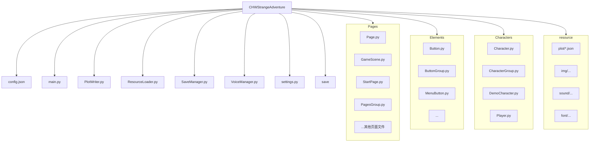

# 项目总结

- **类型**: 基于 `Pygame` 的视觉小说（Galgame）引擎 + 单独的剧情编辑器 `PlotWriter`（Tkinter GUI）。
- **主要功能**: 资源并行加载、页面/场景生命周期管理、角色与对话渲染、存档（读/写/覆写/删除）管理、音频播放与事件、剧情 JSON 编辑导出。

## 主要模块与实现逻辑（详尽版）

- `main.py`（入口与全局协调器）
  - 核心类: `Game`
    - 初始化顺序：
      1. 初始化子系统引用：`ResourceLoader`、`SaveManager`、`VoiceManager`。
      2. 读取配置文件 `config.json` 并设置音量/分辨率初始值。
      3. 创建页面组 `PagesGroup`（由 `Pages` 下的各页面实例化并注册）。
      4. 创建并启动后台线程 `thread_init`（目标 `_threading_start_`）用于并行初始化角色与页面，避免阻塞主线程的开场动画。
    - 运行时逻辑：主循环中先等待资源与存档加载完成（`loader.check_load_finish()` 与 `save_manager.check_load_finish()`），随后根据当前状态路由事件：
      - 开始菜单状态（`_on_game_begin_`）：处理开始/载入/设置/退出按钮，且会打开对应页面（如 `SettingsScene`）。
      - 新游戏（`_game_begin_new_`）与载入游戏（`_game_begin_load_`）：分别进入 `StartChapter` 输入与 `GameScene` 的读取/初始化逻辑。
    - 页面与配置保存：在设置保存时（`_frame_event_`/`_voice_event_`）更新 `config.json` 并改变显示模式（窗口/全屏）与音量。

- `ResourceLoader.py`（资源并行加载器）
  - 资源归类：`img`（背景/章节背景/图标/标题）、`button`（帧动画序列）、`font`（多字号）、`plot`（剧情 JSON）、`characters`（角色贴图）以及黑场 Surface 池。
  - 并行策略：为每个资源目录或资源类别创建独立线程（例如对每个 `img_resource_path` 项都启动一个线程），并在加载每个文件时更新 `current_progress`。所有线程启动后可通过 `wait_load_finish()` join 阻塞等待，或通过 `get_progress()` 在 UI 上绘制进度。
  - 数据接口：所有加载结果写入模块级字典（例如 `ResourceLoader.bg_dict`、`button_dict`、`font_dict`、`plot_dict`），运行时直接通过这些字典索引资源名称获取 Surface/Font/数据。
  - 细节/注意点：
    - `final_progress` 为预设值（需手动维护），用于计算进度比率。
    - `black_surfaces_list` 预先生成多张不同 alpha 的黑色 Surface，便于做渐入/渐出效果且避免运行时频繁创建 Surface。

- `SaveManager.py`（存档管理）
  - 存档模型：每个存档以 `.chw` 文件（JSON 格式）保存在 `save/` 目录，内容包含 `player`（名字、属性）、`chapter_data`（章节/场景/对话索引）与 `bg` 等。
  - 加载策略：`init_save_data()` 为每个存档文件创建一个线程去读取，回调结果写入 `self.save_datas` 字典（键为 `文件名.chw`）。
  - 接口：`save_save_data()`（新建）、`cover_save_data()`（覆盖）、`delete_save_data()`（删除文件）以及 `get_current_save()`/`set_current_save_name()`。
  - 完成检测：`check_load_finish()` 通过比较已读字典长度与 `save` 目录中文件数来判断完成（轮询式，`wait_load_finish()` 目前为 busy-wait，建议改为等待/通知机制或短 sleep）。

- `VoiceManager.py`（音频管理）
  - 组件：使用 `pygame.mixer.music` 播放 BGM，使用 `pygame.mixer.Channel` 的两个通道分别处理角色语音与特效音效。
  - 事件：为每个通道与背景音乐设置 `USEREVENT` 事件编号，游戏可监听这些事件以实现语音结束触发后续逻辑（例如自动推进）。
  - 控制：`set_volume((bgm,char,effect))` 设置三类音量，`play_bgm(name)` 用于循环播放指定 BGM。

- `Pages`（页面体系）
  - 抽象基类 `Page`：定义生命周期接口 `init()`、`handle_event(event)`、`draw()`、`reset()`；并提供静态窗口尺寸配置和若干工具方法（如调试显示 `rect_show()`）。
  - 页面注册与管理：`PagesGroup`（在 `Pages/PagesGroup.py`）负责保存页面实例列表，并在需要时按优先级切换/初始化/重置页面。
  - 典型页面：
    - `StartPage`：使用 `ResourceLoader` 提供的大背景、标题、按钮序列；布局按钮并在 `handle_event` 中判断按钮是否被点击以触发游戏状态转换。
    - `GameScene`：核心渲染器，职责包括：
      - 读取并持有 `plot`（剧情数据）以及 `character_group` 引用。
      - 根据 `current_chapter` / `current_scene` / `dialog_index` 选择当前对话项并渲染：背景、角色贴图（按情绪与位置缩放/定位）、对话框（名字与文字）、选项框（提前渲染未选/悬停态图片并以 `MenuButton` 封装）。
      - 处理交互：按钮点击（回退/播放音频/保存/自动）和选项选择（切换 `current_scene` 并把 `dialog_index` 重置）。
      - 自动模式：通过 `pygame.time.set_timer` 注册定时事件，结合语音播放结束事件推进对话。

- `Elements`（UI 组件）
  - `Button`：支持将一组帧序列作为动画，内部维护 `index` 推进动画帧，提供 `hover_animation()`、`setting_button_animation()`、`is_press_down(event)` 等便利方法，适合直接 blit 到屏幕或其它 surface。
  - `MenuButton` 与 `ButtonGroup`：`MenuButton` 用于菜单型小图标（有正常/hover 两帧），`ButtonGroup` 管理一组按钮的统一更新与绘制。

- `Characters`（角色系统）
  - `Character`：保存 `name`、`emotions`（字典：emotion->Surface）和 `name_surface`（用于对话名显示），以及 `Id`。
  - `CharacterGroup`：负责加载角色贴图目录、根据名字返回角色实例（并创建必要的 `name_surface`）、在 `GameScene` 渲染时按需访问。

- `PlotWriter.py`（剧情编辑器）
  - 功能：图形化创建/编辑场景（scene）与条目（dialogue/choice），支持为每条 dialogue 编辑 speaker/character/text/choices，最终导出 JSON 文件放入 `resource/plot` 使用。
  - 交互设计：左侧场景列表、中间条目列表、右侧条目详细编辑区；选择场景/条目后右侧即时显示并允许修改，保存会写回文件。

## 我认为比较巧妙/值得注意的实现

- 并行加载资源与并行读取存档，减少主线程等待，提升开场展示体验。
- 预生成不同 alpha 的黑场 Surface 池用于渐隐效果，既省时又省内存分配开销。
- 使用 `USEREVENT` 编号在音频结束时触发逻辑，配合定时器实现自动模式推进。
- `PlotWriter` 解耦编辑流程与运行环境，提高剧本创作效率并降低出错概率。

## 项目结构（Mermaid 表示）

---

（已扩展主要模块实现逻辑）
