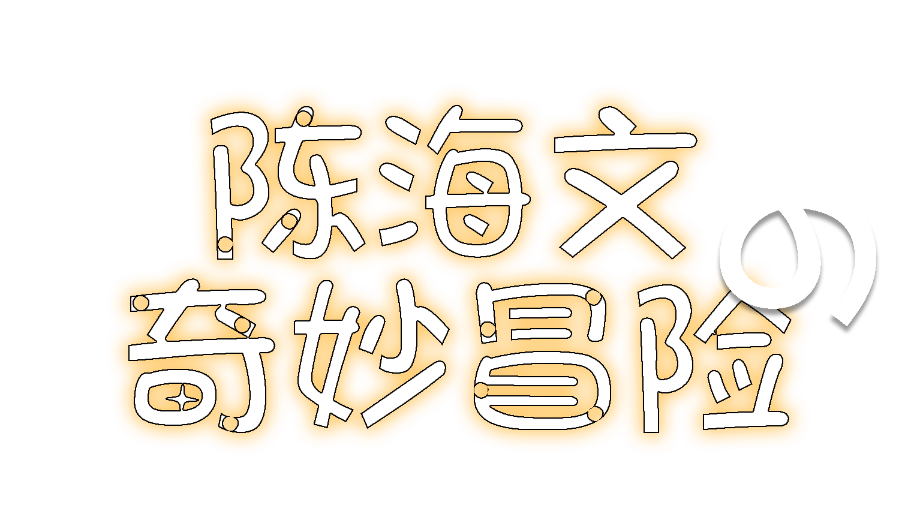

<h1 style="text-align:center">CHW Strange Adventure</h1>



## 介绍 ##
本项目是一个`python`课程设计，基于`Pygame`制作的GalGame游戏Demo。

## 联系方式 ##
QQ:  <br>
Email: <EMAIL>
## 运行 ##
下载并安装`Python3.x`环境,和`pygame`库<br>
或者安装uv包管理工具
```commandline
pip install uv
```

在此更推荐使用`uv`包管理工具安装依赖库<br>
通过uv来补全依赖库，并安装pygame库。
```commandline
uv sync
```

在确保依赖库安装成功后，运行游戏
```commandline
python main.py 
```
## 更新日志 ##
`2025.10.18` 当前游戏版本处于测试阶段，欢迎大家提出宝贵意见。`v-0.1.0`

